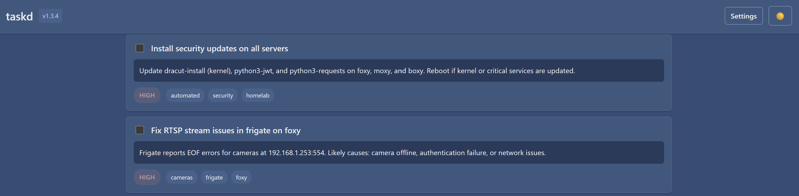
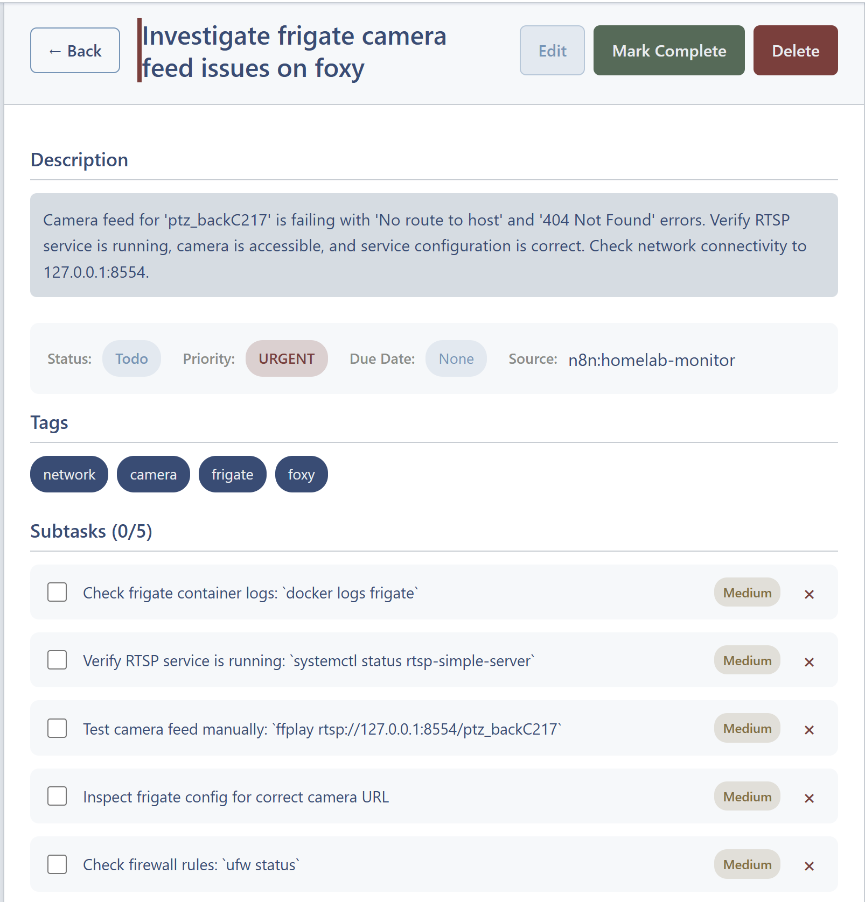
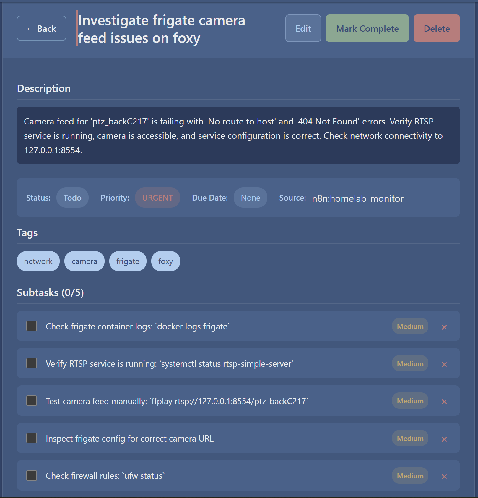
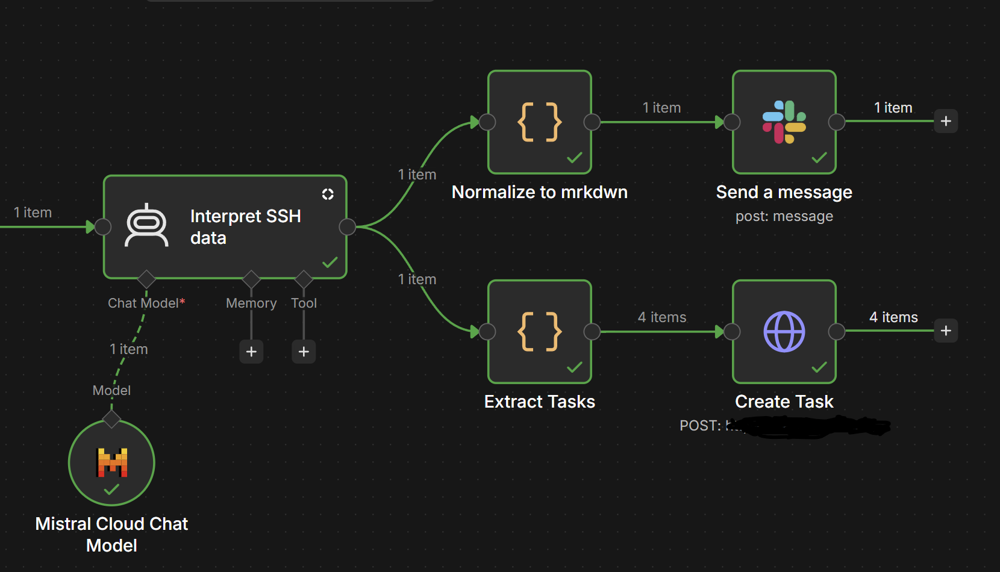

# taskd

A lightweight, self-hosted task management application with REST API and web GUI.

## Screenshots

**Main page (dark theme)**



**Task detail (light and dark themes)**

<table>
  <tr>
    <td width="50%" align="center">Light theme</td>
    <td width="50%" align="center">Dark theme</td>
  </tr>
  <tr>
    <td></td>
    <td></td>
  </tr>
</table>

**Task created by n8n automation** — automated tasks carry a `source` tag and filterable tags



## Features

- **Task Management**: Create, read, update, delete tasks with full CRUD support
- **Tags**: Auto-created, case-insensitive tags with color support
- **Subtasks**: One-level deep subtask nesting
- **Recurring Tasks**: Simple daily/weekly/monthly recurrence rules
- **Filtering**: Filter by status, priority, tag, due date, or search text
- **Sorting**: Sort by created, updated, due date, priority, or name
- **Web GUI**: Responsive React frontend served from the same container
- **API**: Full REST API with OpenAPI documentation at `/docs`
- **Home Assistant**: Native to-do list integration via [ha-taskd](https://github.com/robsterba/ha-taskd)
- **n8n**: API endpoints purpose-built for workflow automation
- **Webhooks**: Push task events to external URLs with HMAC-SHA256 signatures
- **Theme Support**: Light theme plus two dark themes (Blue and AMOLED Black) with system preference detection

## GUI Features

### Theme Toggle

The GUI supports a light theme and two dark themes. Click the theme toggle button (sun/moon icon) in the top-right corner to switch between light and your preferred dark theme. Choose the dark variant (Blue or AMOLED Black) in Settings; it applies immediately while in dark mode. Your preference is saved to localStorage and will persist across sessions. On first visit, the app automatically detects your system's color scheme preference.

## Quick Start

### Using Docker Compose

```bash
# Start the application
docker-compose up -d

# View logs
docker-compose logs -f

# Stop the application
docker-compose down
```

The application will be available at:
- GUI: http://localhost:8000
- API Docs: http://localhost:8000/docs
- Health: http://localhost:8000/api/v1/health

### Using Docker Directly

```bash
# Build the image
docker build -t taskd .

# Run with data volume
docker run -d \
  --name taskd \
  -p 8000:8000 \
  -v taskd_data:/data \
  --restart unless-stopped \
  taskd
```

## API Endpoints

### Tasks
- `GET /api/v1/tasks` - List tasks with filtering
- `POST /api/v1/tasks` - Create a task
- `GET /api/v1/tasks/{id}` - Get a single task
- `PATCH /api/v1/tasks/{id}` - Update a task
- `DELETE /api/v1/tasks/{id}` - Delete a task
- `POST /api/v1/tasks/{id}/complete` - Mark task as complete
- `GET /api/v1/tasks/changed?since=...` - Get changed tasks

### Tags
- `GET /api/v1/tags` - List all tags
- `PATCH /api/v1/tags/{name}` - Update a tag
- `DELETE /api/v1/tags/{name}` - Delete a tag

### Webhooks
- `GET /api/v1/webhooks` - List registered webhooks
- `POST /api/v1/webhooks` - Register a webhook
- `GET /api/v1/webhooks/{id}` - Get a single webhook
- `PATCH /api/v1/webhooks/{id}` - Update a webhook
- `DELETE /api/v1/webhooks/{id}` - Delete a webhook
- `POST /api/v1/webhooks/{id}/test` - Send a test event to the webhook URL
- `GET /api/v1/webhooks/{id}/deliveries` - List recent deliveries

### Health
- `GET /api/v1/health` - Health check

## Query Parameters (Tasks List)

- `status`: Filter by status (todo, in_progress, done, archived)
- `priority`: Filter by priority (low, medium, high, urgent)
- `tag`: Filter by tag name (can be repeated for AND logic)
- `parent`: Filter by parent ("none" for top-level, or task ID for subtasks)
- `due_before`: Filter tasks due before date (ISO 8601)
- `due_after`: Filter tasks due after date (ISO 8601)
- `search`: Search in name and description
- `sort`: Sort field (created_at, updated_at, due_date, priority, name) - prefix with `-` for descending
- `limit`: Max results (1-500, default 100)
- `offset`: Pagination offset

## Task Fields

| Field | Type | Required | Default | Description |
|-------|------|----------|---------|-------------|
| id | string (UUID) | auto | - | Generated server-side |
| name | string | yes | - | Max 500 characters |
| description | string | no | - | Supports markdown |
| status | enum | yes | todo | todo, in_progress, done, archived |
| priority | enum | no | medium | low, medium, high, urgent |
| due_date | datetime | no | - | ISO 8601 UTC |
| parent_task_id | string (UUID) | no | - | For subtasks |
| recurrence | object | no | - | `{interval, interval_count}` |
| source | string | auto | api | Creation source |
| tags | array | no | - | List of tag names |
| created_at | datetime | auto | - | UTC timestamp |
| updated_at | datetime | auto | - | UTC timestamp |

## Recurrence Rules

```json
{
  "interval": "daily" | "weekly" | "monthly",
  "interval_count": 1
}
```

When a recurring task is marked as done, the next occurrence is automatically created.

## Quick Add Syntax

In the quick add input, you can use:
- `#tag` - Add a tag
- `!priority` - Set priority (!urgent, !high, !medium, !low)

Example: `Buy groceries #shopping !high`

## n8n Integration

taskd is designed to work seamlessly with [n8n](https://n8n.io), the open-source workflow automation tool. The API endpoints are purpose-built for n8n HTTP Request nodes.

### Recommended Conventions

When creating tasks from n8n workflows:
- Always include `"source": "n8n"` (or your workflow name) to identify automated tasks
- Use the `"tags": ["automated", ...]` pattern to make automation tasks filterable in the GUI
- Tag by workflow purpose: `"backup"`, `"monitoring"`, `"alert"`, etc.

### Example: Creating Tasks

Use an HTTP Request node to POST to `/api/v1/tasks`:

```json
{
  "name": "Backup database",
  "description": "Daily backup of production database",
  "tags": ["automated", "backup", "daily"],
  "source": "n8n",
  "priority": "high",
  "due_date": "2026-09-26T02:00:00Z"
}
```

### Example: Monitoring for Task Completions

Many n8n workflows need to trigger when tasks reach certain states. Use a **Schedule Trigger** (e.g., every 5 minutes) with an HTTP Request node:

**Method:** GET
**URL:** `/api/v1/tasks/changed?since={{ $now.subtract(5, 'minutes') }}`

This returns all tasks updated in the last 5 minutes. Then use an **IF** node to filter for:
- `status === "done"`
- `tags.includes("automated")`
- `source === "n8n"`

### Example: Agentic Workflows

Build workflows that react to task state changes:

1. **Trigger:** Schedule every 1-5 minutes
2. **Action:** GET `/api/v1/tasks/changed?since={{ $now.subtract(5, 'minutes') }}`
3. **Filter:** Tasks with `status === "done"` AND `tags.includes("automated")`
4. **Execute:** Your automation logic (e.g., send notification, trigger shutdown, etc.)

### Example: Daily Digest

Create a workflow that sends a daily summary:

1. **Trigger:** Schedule at 9:00 AM daily
2. **Action:** GET `/api/v1/tasks?due_before={{ $now.endOfDay() }}&status=todo`
3. **Process:** Format the results into a summary
4. **Deliver:** Send via email, Slack, or your preferred channel

### Example: Escalation Workflow

Automatically escalate overdue high-priority tasks:

1. **Trigger:** Schedule every hour
2. **Action:** GET `/api/v1/tasks?status=todo&priority=high&due_before={{ $now }}`
3. **Filter:** Tasks that are overdue
4. **Action:** PATCH each task to add `"escalated"` tag and send alert

## Webhooks

For push-based automation, register a webhook and taskd will POST an event to your URL the moment a task changes — no polling required. Point an n8n **Webhook** trigger node (or any HTTP receiver) at the URL you register:

```bash
curl -X POST http://localhost:8000/api/v1/webhooks \
  -H "Content-Type: application/json" \
  -d '{"url": "https://n8n.example.com/webhook/taskd", "events": ["task.created", "task.completed"]}'
```

The response includes a generated `secret`. Every delivery is signed: the `X-taskd-Signature` header contains the HMAC-SHA256 hex digest of the request body, computed with that secret. Verify on the receiver:

```python
import hmac, hashlib
expected = hmac.new(secret.encode(), raw_body, hashlib.sha256).hexdigest()
hmac.compare_digest(expected, request.headers["X-taskd-Signature"])
```

### Events

| Event | Fired when |
|-------|-----------|
| `task.created` | A task is created (one event, including any subtasks in the payload) |
| `task.updated` | A task is patched (any change, including status changes to non-done states) |
| `task.completed` | A task transitions to `done` (via PATCH or the complete endpoint) |
| `task.deleted` | A task is deleted (payload includes the subtasks that were removed with it) |

Payload shape:

```json
{
  "event": "task.created",
  "timestamp": "2026-09-28T14:32:11.123456+00:00",
  "task": { "id": "…", "name": "…", "status": "todo", "tags": ["…"], "subtasks": [ … ] }
}
```

Notes:
- Subtasks created in the same `POST /api/v1/tasks` call are nested in the payload; a subtask added later fires its own `task.created` with `parent_task_id` set.
- Completing a recurring task fires `task.completed` for the completed occurrence, followed by `task.created` for the spawned next occurrence.
- Deliveries are retried up to 3 times (5s timeout each) and the last 50 delivery results per webhook are logged, viewable via `GET /api/v1/webhooks/{id}/deliveries` or the Settings panel in the GUI.
- Webhooks are registered system-wide and fire for all tasks; filter on the receiving side by tags, source, or task fields.

## Home Assistant Integration

[ha-taskd](https://github.com/robsterba/ha-taskd) is a companion Home Assistant integration that exposes your taskd tasks as a native **to-do list entity** (`todo.taskd`). View, create, complete, rename, schedule, and delete tasks directly from HA dashboards (the built-in To-Do List card) and HA Assist voice commands.

Highlights:

- **Full task lifecycle** — create, complete/uncomplete, rename, update description, set due dates, delete
- **Quick-add syntax** — same as the taskd GUI: `#tag` tokens become tags, `!priority` sets priority
- **Recurrence support** — completing a recurring task from HA spawns the next occurrence (handled server-side by taskd)
- **Polling sync** — configurable scan interval (default 60s); changes made in the taskd GUI or via n8n appear in HA automatically
- **`taskd.create_task` service** — for HA scripts and automations
- **Source tagging** — tasks created in HA get `source: homeassistant`, so they can be filtered in the taskd GUI

Install it from HACS (add `robsterba/ha-taskd` as a custom repository of type Integration), restart Home Assistant, then add the **taskd** integration from Settings → Devices & Services and point it at your taskd base URL (e.g. `http://192.168.1.140:8000`).

## Configuration

Environment variables:
- `PORT` - HTTP port (default: 8000)
- `DATA_DIR` - Database directory (default: /data)

## Versioning

taskd uses a **major.minor** versioning scheme. The version is stored in the `VERSION` file at the project root and is automatically displayed in the GUI header and available via the API.

### Current Version
The current version is displayed in the top-right of the GUI (e.g., `v1.0.0`).

### API Endpoints
- `GET /api/v1/version` - Returns `{"version": "X.Y.Z"}`
- `GET /api/v1/health` - Includes version in the response

### Updating the Version
To update the version (e.g., for a release):

1. Edit the `VERSION` file at the project root
2. Update the version number (e.g., from `1.0.0` to `1.1.0`)
3. Commit the change

The version will automatically be picked up by both the backend and frontend.

### Releases

`VERSION` is the single source of truth. To cut a release:

1. Bump `VERSION` at the project root.
2. Commit and push to `main`.
3. Tag and push the tag: `git tag v1.3.5 && git push origin v1.3.5`.

CI runs the backend test suite on every push, verifies the tag matches
`VERSION`, builds the Docker image, pushes it to
`ghcr.io/robsterba/taskd` (tagged `X.Y.Z` and `latest`), and publishes
a GitHub Release with generated notes.

**Version Format:** `MAJOR.MINOR`
- **MAJOR**: Incremented for breaking changes or significant new features
- **MINOR**: Incremented for backwards-compatible new features or improvements

## Architecture

- **Backend**: FastAPI (Python)
- **Database**: SQLite (file-based, mounted as volume)
- **Frontend**: React 18 with Vite
- **Container**: Multi-stage Docker build
  - Stage 1: Node.js for building React
  - Stage 2: Python slim for runtime
- **Single Container**: All components run in one container on port 8000

## Project Structure

```
taskd/
├── backend/           # FastAPI backend
│   └── app/           # Python application
│       ├── __init__.py
│       ├── main.py    # FastAPI app
│       ├── database.py
│       ├── models.py
│       ├── schemas.py
│       ├── routers/
│       │   ├── __init__.py
│       │   ├── tasks.py
│       │   └── tags.py
│       ├── services/
│       │   ├── __init__.py
│       │   ├── task_service.py
│       │   └── tag_service.py
│       └── utils/
│           ├── __init__.py
│           └── recurrence.py
├── frontend/          # React frontend
│   ├── public/        # Static assets
│   │   └── favicon.svg
│   └── src/           # React source
├── docs/
│   └── screenshots/   # README screenshots
├── Dockerfile         # Multi-stage build
├── docker-compose.yml
└── README.md          # This file
```

## Development

### Backend Development

```bash
cd backend
pip install -r requirements.txt
uvicorn app.main:app --reload --port 8000
```

### Frontend Development

```bash
cd frontend
npm install
npm run dev
```

The frontend dev server will proxy API requests to http://localhost:8000.

## Testing

Test the API using curl:

```bash
# Create a task
curl -X POST http://localhost:8000/api/v1/tasks \
  -H "Content-Type: application/json" \
  -d '{"name": "Test task", "tags": ["test"]}'

# List tasks
curl http://localhost:8000/api/v1/tasks

# Get a task
curl http://localhost:8000/api/v1/tasks/<id>

# Update a task
curl -X PATCH http://localhost:8000/api/v1/tasks/<id> \
  -H "Content-Type: application/json" \
  -d '{"status": "done"}'

# Delete a task
curl -X DELETE http://localhost:8000/api/v1/tasks/<id>
```

## License

This project is licensed under the MIT License — see the [LICENSE](LICENSE) file for details.
